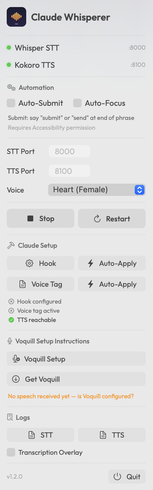

# Claude Whisperer

Voice mode for [Claude Code](https://claude.ai/claude-code) on Apple Silicon. Talk to Claude, hear Claude talk back — all running locally on your Mac.

<p align="center">
  
</p>

## What It Does

You use Claude Code normally. After every response, Claude's answer is automatically spoken aloud through your Mac's speakers using a local TTS model. For speech input, pair with [Voquill](https://github.com/nicobailey/Voquill) to dictate instead of type.

Everything runs on your Mac — no cloud APIs, no data leaves your machine.

## Install

[**Download ClaudeWhisperer-1.2.0.dmg**](https://github.com/PerIPan/Claude-Whisperer/releases/download/v1.2.0/ClaudeWhisperer-1.2.0.dmg) — drag to Applications and launch.

On first launch, the app:
- Creates a Python environment with all dependencies
- Downloads MLX Whisper (~1.5GB) and Kokoro TTS (~300MB) models
- Starts both servers automatically

The menubar icon gives you:
- Start/Stop/Restart servers with configurable ports
- **Voice picker** — choose from 8 Kokoro voices (no server restart needed)
- **Automation** — Auto-Submit and Auto-Focus (requires Accessibility permission)
- **Auto-Apply** — one-click setup for Claude hook (settings.json) and voice tag (CLAUDE.md)
- **Diagnostic checklist** — shows hook, voice tag, and TTS status at a glance
- **Transcription overlay** — floating window showing live speech-to-text output
- Voquill Setup + download link (with detection hint if no speech received)
- Separate STT and TTS logs (STT log includes transcribed text)

After setup, use the menubar buttons for configuration instructions.

## Speech Input with Voquill

To talk *to* Claude (not just hear it), use [Voquill](https://github.com/nicobailey/Voquill) — a free, open-source macOS dictation app. Configure it to use your local Whisper server for much better accuracy than macOS dictation.

### Voquill Setup

1. Download [Voquill](https://github.com/nicobailey/Voquill) from GitHub releases
2. Open Voquill → **Settings** → **Transcription**
3. Set mode: **OpenAI Compatible API**
4. Endpoint URL: `http://localhost:8000`
5. Model: `whisper`
6. API key: `whisper`
7. Language: `en` (or your preferred language)

**Test it:** Speak into Voquill. You should see `POST /v1/audio/transcriptions` in the server terminal.

### Automation

Both features are in the **Automation** section of the menubar and require **Accessibility permission** (macOS will prompt you on first use).

#### Auto-Submit

Enable **Auto-Submit** to submit messages by voice. Say one of these trigger words at the end of your phrase:

- "submit", "send", "send it", "go ahead", "enter"

Example: *"fix the login bug, submit"* → types "fix the login bug" and presses Cmd+Enter.

**Barge-in:** When Auto-Submit triggers, any currently playing TTS audio is automatically interrupted so Claude can start working on your new request immediately.

#### Auto-Focus

Enable **Auto-Focus** to automatically bring a specific app to the front when you finish speaking. Pick from the dropdown (VS Code, Code Insiders, Cursor, Windsurf, Terminal, iTerm2, Warp, Alacritty, Ghostty) or select **Custom** to type any app name.

This is useful when you're speaking into Voquill from another window — the transcribed text will be typed into the focused target app.

### Why Voquill + Local Whisper?

- **Way more accurate** than macOS dictation for code, technical terms, abbreviations
- **Works system-wide** — global hotkey, types into any app including Claude Code
- **Glossary** — add your project's API names, libraries, etc. for even better accuracy
- **100% local** — audio never leaves your Mac

### Fallback: macOS Dictation

If you don't want to install Voquill, press **fn fn** to use built-in macOS dictation. Less accurate for technical terms, but works instantly with zero setup.

## How the VOICE Tag Works

Claude adds a `[VOICE: ...]` tag at the end of every response:

```
Here's the full code with detailed explanation...

[VOICE: I added the login endpoint. It validates the email and returns a JWT token.]
```

- **Screen**: You see the full detailed response
- **Speakers**: You hear only the short spoken summary
- The hook script extracts the tag, sends it to Kokoro TTS, and plays the audio
- If there's no `[VOICE:]` tag, the hook falls back to stripping markdown and reading the raw text (truncated to ~600 chars)

## Configuration

| Variable | Default | Used by | Description |
|----------|---------|---------|-------------|
| `TTS_URL` | `http://localhost:8100/v1/audio/speech` | tts-hook.sh | TTS server endpoint |
| `TTS_VOICE` | `af_heart` | tts-hook.sh | Kokoro voice name |
| `TTS_MODEL` | `prince-canuma/Kokoro-82M` | tts-hook.sh | TTS model |
| `STT_PORT` | `8000` | whisper_server.py | Whisper server port |
| `WHISPER_MODEL` | `mlx-community/whisper-large-v3-turbo` | whisper_server.py | Whisper model |

## Troubleshooting

**No audio after Claude responds:**
1. Check TTS server is running: `curl http://localhost:8100/models`
2. Test TTS directly: `echo "hello" | ./scripts/speak.sh`
3. Check the hook path in `settings.json` is correct and absolute

**Voquill not transcribing:**
1. Check Whisper server is running: `curl http://localhost:8000/models`
2. Verify Voquill mode is **OpenAI Compatible API**
3. Verify endpoint is `http://localhost:8000`
4. Model: `whisper`, API key: `whisper`

**422 error from TTS:**
- Make sure `model` field is included in requests
- Run `./setup.sh` again to reinstall spaCy model

---

## Manual Setup (from source)

> **Tip:** You can ask your AI assistant (Claude, ChatGPT, etc.) to run these steps for you. Just paste the section below into your AI chat.

### Prerequisites

- Mac with Apple Silicon (M1/M2/M3/M4)
- [Claude Code](https://claude.ai/claude-code) (CLI or VS Code extension)
- [uv](https://docs.astral.sh/uv/) (`curl -LsSf https://astral.sh/uv/install.sh | sh`)
- [jq](https://jqlang.github.io/jq/) — install with one of:
  ```bash
  # Option A: Direct download (no package manager needed)
  curl -L -o /usr/local/bin/jq https://github.com/jqlang/jq/releases/download/jq-1.7.1/jq-macos-arm64 && chmod +x /usr/local/bin/jq

  # Option B: Homebrew (if you have it)
  brew install jq
  ```

### Step 1: Install

```bash
git clone https://github.com/PerIPan/Claude-Whisperer.git
cd Claude-Whisperer
chmod +x setup.sh && ./setup.sh
```

This creates a Python venv at `~/mlx-openai-whisper` and installs everything (MLX Audio, Whisper, Kokoro TTS, spaCy).

### Step 2: Start the servers

```bash
./servers/start-servers.sh
```

Two servers start:
- `localhost:8000` — Whisper STT (speech-to-text)
- `localhost:8100` — Kokoro TTS (text-to-speech)

Keep this terminal open while using Claude.

### Step 3: Tell Claude to speak

Copy the `CLAUDE.md` file into any project where you want voice mode:

```bash
cp CLAUDE.md ~/my-project/
```

This tells Claude to add a `[VOICE: ...]` tag to every response with a short spoken summary.

### Step 4: Add the TTS hook

Add this to your `~/.claude/settings.json` (or your project's `.claude/settings.json`):

```json
{
  "hooks": {
    "Stop": [
      {
        "hooks": [
          {
            "type": "command",
            "command": "/absolute/path/to/Claude-Whisperer/hooks/tts-hook.sh",
            "timeout": 60
          }
        ]
      }
    ]
  }
}
```

Replace `/absolute/path/to/Claude-Whisperer` with where you cloned the repo (e.g. `/Users/yourname/Claude-Whisperer`).

### Building the App from Source

```bash
cd app
chmod +x build-dmg.sh
./build-dmg.sh
```

Requires Xcode Command Line Tools. Produces `Claude Whisperer.app` and `ClaudeWhisperer-1.2.0.dmg` in `app/.build/`.

## File Structure

```
Claude-Whisperer/
├── CLAUDE.md              # Copy to your project (tells Claude to add VOICE tags)
├── setup.sh               # One-click installer
├── hooks/
│   └── tts-hook.sh       # Claude Code hook — speaks responses via TTS
├── servers/
│   ├── whisper_server.py # Whisper STT server (OpenAI-compatible, auto-submit)
│   └── start-servers.sh  # Launches both servers
├── scripts/
│   └── speak.sh          # Standalone TTS utility (pipe text to hear it)
└── app/                   # macOS menubar app source (Swift)
    ├── Package.swift
    ├── Sources/
    ├── Resources/
    └── build-dmg.sh       # Build the .dmg yourself
```

## Contributing

Contributions are welcome! Feel free to open issues or submit pull requests. Whether it's bug fixes, new features, documentation improvements, or voice model suggestions — all contributions are appreciated.

## Credits

- [MLX Audio](https://github.com/Blaizzy/mlx-audio) — TTS and STT on Apple Silicon
- [Kokoro](https://huggingface.co/prince-canuma/Kokoro-82M) — TTS model
- [Claude Code](https://claude.ai/claude-code) — Anthropic's CLI
- [Voquill](https://github.com/nicobailey/Voquill) — Open source dictation for macOS

## License

MIT
