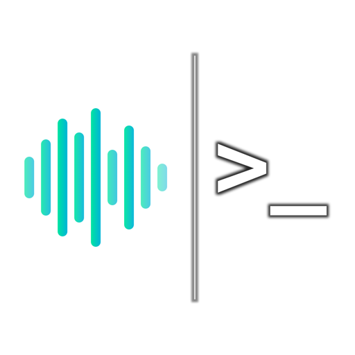

<p align="center">
  
</p>

# Open Whisperer

Full interactive Voice mode for [Claude Code](https://claude.ai/claude-code), [Codex CLI](https://github.com/openai/codex), Antigravity, and Pi on Apple Silicon. Talk to your AI, hear it talk back — all running locally on your Mac. Three voice input modes, voice personas, Auto-Focus & easy setup. Open Source.

<p align="center">
  
  
</p>
<p align="center">
  
  
</p>
<p align="center">
  
</p>

Build from source or DMG, do not pay the 99/year so you would have to allow it to run.

The command to bypass Gatekeeper for the DMG:
xattr -cr /Applications/OpenWhisperer.app

If you want to do it on the DMG itself before opening:
xattr -d com.apple.quarantine ~/Downloads/OpenWhisperer-2.0.6.dmg


## What It Does

You use your coding agent — **Claude Code, Codex, Antigravity, or Pi** — normally. After a turn you dictated by voice, the AI's reply is automatically spoken aloud through your Mac's speakers using a local TTS model. Pick one of the nine accented English/European voices and the reply is written in a persona to match; pick one of the 24 multilingual voices and it's written in that language instead (you can also set replies to always speak — see Response mode). Three voice input modes: **Press-to-Talk** (press hotkey to start/stop), **Hold-to-Talk** (hold hotkey to record, release to transcribe), or **Hands-Free** (say "initiate" to start recording, 3s silence auto-transcribes, say "hold on" to interrupt TTS).

Everything runs on your Mac — no cloud APIs, no data leaves your machine.

## What's New

### 2.0.6

- **Dictation works in iTerm2 again.** Transcribed text wasn't being inserted there at all — and because Auto-Submit's Enter *was* delivered, you got an empty command submitted instead. The accessibility write reported success while silently doing nothing, so the app never fell back to the typing path that works. Writes are now verified rather than trusted, on every app. Thanks to [@natronite](https://github.com/natronite) for the report and the diagnosis ([#49](https://github.com/PerIPan/OpenWhisperer/issues/49)).
- **Multilingual voices follow the language you write in.** A `supertonic:de:M1` voice used to be a hard pin to German — ask for a reply in English and the model would refuse, citing the instruction. Now the engine detects the language of each sentence on-device and speaks it in that language, keeping the same speaker. Kokoro voices are unchanged: a Kokoro voice *is* its language.
- **Pin the reply language if you want one.** `tts_language` (or `OW_TTS_LANGUAGE` per project) names the language every spoken reply is written in, for any voice, whatever the conversation is in.
- **Supertonic upgraded** to FluidAudio 0.15.6.

### 2.0.5

- **The speaking indicator works in every mode.** The "Playing…" status and the speaker icon on the voice preview button only ever updated in Hands-Free; in Press-to-Talk and Hold-to-Talk they were permanently dark. Playback state is now published inside the app rather than polled off disk, so they follow real playback everywhere — and react immediately instead of up to a third of a second late.
- **No more frozen bars on the overlay.** Leaving Hands-Free mid-listen could strand the last analyzer frame on screen, redrawing at 30 fps indefinitely instead of going quiet.
- **The audio spectrum is only analyzed when something draws it.** Every audio buffer was reduced to 96 frequency bands on both the microphone and playback paths, including for the default overlay style, which doesn't display them. That work is now skipped unless a spectrum is actually on screen.
- **Quieter background timers.** Two polls that run for the whole life of the app now let macOS batch their wakeups.
- **The debug log is capped.** `paste_debug.log` had no size limit and grew for the life of an install.

### 2.0.4

- **Speech-to-text moved to upstream WhisperKit 1.1.0.** The app had been pinned to a fork carrying a one-line fix, without which *any* custom vocabulary made every dictation come back empty. Argmax shipped that fix upstream, so the fork is gone from the dependency graph.
- **Custom vocabulary is safe to use again** — that's the fix above, in practical terms.
- **Codex hooks move to `~/.codex/hooks.json`.** Codex warns when hooks are split between `hooks.json` and an inline `[hooks]` table in `config.toml`; it now writes only the former. Reconnect Codex in Settings → Agents to move an existing install.
- **Pi gets the persona and reply-language layers** it was missing, so a spoken reply on Pi now matches Claude Code and Codex.
- **No more "SDK auth failed" noise on Claude Code start.** Claude Code probes for an OAuth endpoint before connecting; the server answered with an empty body, which its SDK parsed as a malformed OAuth error and logged every time. It now answers with a proper JSON body.

### 2.0.3

- **First-run setup** — a four-pane sheet on first launch: permissions, dictation, voice, and connecting your coding agent. It replaces being dropped into Settings with a wall of JSON over it, and carries model-download progress the whole way through. Skippable at every step, and reopenable any time from the menubar → **Setup…**.
- **Personas are no longer a secret.** Choosing a voice has always attached a national character to every spoken reply — French dry and faintly unimpressed, Hindi irrepressibly helpful — and nothing in the app ever said so. The voice picker now names each language group's persona, and the selected one is spelled out under the picker.
- **Pick a persona yourself** — Settings → Voice → **Persona**. Defaults to **Automatic**, which is the voice's own character, so nothing changes unless you change it. Multilingual (Supertonic) voices get no persona automatically; selecting one here is currently the only way to give them any.
- **Larger type** throughout the windows. The overlay is untouched.

### 2.0.1

- **Six themes** — Settings → General → **Themes**. **Cream** is the original look and stays the default; **Light** and **Dark** are neutral greyscale; **Pastel**, **Champagne** and **Sky** come from the Authé design system. Settings, the menubar popover and the dictation overlay all follow your choice.
- **Only Cream follows your Mac's light/dark setting.** Every other theme holds its look whatever macOS is doing — each one says so under the picker.

### 2.0.0

- **It speaks Dutch, German, Polish, Russian and Ukrainian** — languages Kokoro has no voice for. Until now those replies were read aloud by an *English* voice, which isn't "accented" so much as unintelligible: feed the old Dutch audio to a speech recognizer and it comes back as `"D test Slagin New Alemolol."` (~100% error). The new voices come back as the sentence (~4%).
- **A second engine, picked by measurement** — **Supertonic-3** runs alongside Kokoro (both already inside the app's speech library, so there's no new binary to trust). It's ~10× faster than the existing English voices on the Neural Engine, so spoken replies start sooner.
- **Your reply is written in the voice's language** — picking a Dutch voice isn't enough on its own, since a Dutch voice reading English text helps nobody. Your agent is now told to write the spoken summary in that language; your on-screen reply is untouched.
- **Nothing changes if you're on English** — the multilingual model (~264 MB) downloads only when you actually pick one of these voices, and every existing voice setting keeps working.
- **A "Full" length and an "Only when I'm needed" mode** — Full speaks a paragraph that explains the reasoning rather than just summarizing. "Only when I'm needed" stays silent while work succeeds and speaks up only when the turn ends on you: a question, a blocked step, an approval, or a failure — so you can walk away from a long run and be told when you're wanted.
- **Smaller Settings window**, a **Record Voice & Text** entry in the menubar (placeholder for now), and a quieter overlay and Agents tab.

<details>
<summary><strong>Earlier releases — 1.6.x, 1.5.x</strong> (Antigravity & Pi, voice personas, native rewrite, streaming TTS)</summary>

### 1.6.0

- **Two more agents — Antigravity & Pi** — spoken replies now work beyond Claude Code and Codex in the **Antigravity** CLI (`agy`) and **Pi**. Pick your agent in the **Agents** settings and **Auto-Apply** wires it up: Claude Code, Codex, and Antigravity get a hook plus a `speak` tool; Pi gets a drop-in extension.
- **Voice personas** — pick a voice with a national accent and the reply is written to match its character: the British voice turns dry and deadpan, the Italian voice warm and expressive, the Japanese voice courteous and understated, and so on across nine accents. It colors tone only — it never changes the facts.
- **Mid-turn speaking** — replies are spoken through an in-app `speak` tool the agent calls, so speech can start mid-turn instead of only after the whole reply lands. (Pi uses an equivalent extension.)
- **Adjustable speaking speed** — a **Speed** slider in Voice Settings sets how fast replies are spoken (0.7×–1.5×, default 1.1×). Per-project override via `OW_TTS_SPEED`.
- **Simpler Response modes** — the little-used "when Text" option is gone; **Response** is now **when Voice** (dictated turns only, the default) or **Always**.
- **Steadier voice handling** — an invalid voice name from the model is ignored (it falls back to your selected voice) instead of erroring, and the transcription overlay now takes the first click even when the app is in the background — click any line to copy it.

### 1.5.2

- **Will-speak indicator** — the menubar icon turns into a speaker (and the status pill reads **Standby · will speak**) whenever your next dictated turn's reply is set to be spoken, so a turn that silently *won't* speak (you edited the prompt, or dictated twice into one input) no longer looks like a bug. It only lights up when you dictate into a terminal or editor — dictating into WhatsApp, Safari, or Mail leaves it dark.
- **Overlay transcription history** — the floating overlay's transcript pane now shows each dictation as it happens (it had been silently empty since the native rewrite, watching a log the old Python server used to write).
- **First-run download progress** — the menu shows a live percentage while the speech model downloads, then a clear "compiling for the Neural Engine" message. If a model fails to load, a banner explains why with **Retry** and **Copy Diagnostics** buttons.
- **Copy Diagnostics** — a button in **Server & Logs** copies a support-ready report (app/macOS versions, permission states, model/cache status, free disk space, recent log lines) to the clipboard.
- **More reliable Codex replies** — spoken replies on Codex CLI are now matched to your dictated turn by content, so a parallel or typed turn can't steal or silence the reply you meant to hear.
- **Voice-download hardening** — alternative Kokoro voices (Bella, Michael, Siwis, …) reject a bad server response instead of caching an error page in place of the voice.

### 1.5.1

- **Auto-focus any installed app** — the **Automation** dropdown now offers a searchable list of *every* app installed on your Mac (Word, WhatsApp, Slack, …), alongside the curated dev/terminal favorites and a Custom entry. Search it by name and pin dictation to whichever app you like.
- **Snappier menu** — fixed a 3–4 second freeze when opening the menubar popover. A synchronous "launch at login" status check (an XPC call to `launchservicesd`) was blocking the main thread on every open; it now runs off-main.
- **Response mode** — a new **Response** control in Voice Settings (beside Style) chooses *when* replies are spoken: **when Voice** (dictated turns only — the default, unchanged) or **Always**. Per-project override via `OW_TTS_RESPONSE`.
- **Automation polish** — "with return" is grouped under auto-focus, and the behavior hint now reflects your exact auto-focus / with-return / auto-submit combination.
- **In-app help** — a hover **ⓘ** on every section explains what it does, and the Hook setup instructions are corrected to document both hooks (Stop + UserPromptSubmit).
- **Menu tidy** — the auto-focus card is now **App Focus Automation**, the platform/setup card is **Setup TTS for** (with Volume tucked inside), and all section titles share one consistent weight.

### 1.5.0

- **Fully native, no Python** — speech-to-text (WhisperKit) and text-to-speech (FluidAudio Kokoro) run in-process on the Apple Neural Engine. The Python server, virtualenv, and `setup.sh` are gone, so install is just "drag to Applications," cold start is faster, and a whole class of dependency-drift failures disappears.
- **In-app streaming playback + instant barge-in** — replies start speaking after the first sentence and play gaplessly; saying "hold on" (or starting a new turn) stops audio *and* cancels in-flight synthesis in-process, freeing the Neural Engine immediately.
- **Tagless voice mode** — no more `[VOICE:]` tag in `CLAUDE.md`. The app fingerprints each dictation and a `UserPromptSubmit` hook routes the spoken reply to the session you actually dictated into; only dictated turns are spoken.
- **Warm redesign** — the menubar and transcription overlay now match [openwhisperer.com](https://openwhisperer.com): a warm cream/gold palette with a Fraunces serif wordmark, in full light **and** dark mode.
- **WhisperKit 1.0** — the speech-to-text engine is updated to the 1.0 stable release.
- **Reliability hardening** — generation-guarded TTS cancellation, a request body-size cap and surfaced bind-failure on the loopback TTS server, the "Speaking…" lock now clears if the output device drops mid-reply, and a uniform voice-turn freshness window so dictating then pausing before submit still speaks.
- **Garbled-speech fix on Apple Silicon** — on some chips (notably M3 / macOS 15) a strided CoreML array was mis-read, producing fluent-but-*wrong*, "foreign-sounding" speech regardless of the text; updated to the upstream fix so synthesis is correct across Apple Silicon generations.
- **Delete downloaded models** — a maintenance button in **Server & Logs** clears the STT/TTS model caches after a confirmation that shows how much space it frees; the models re-download automatically on next use.

</details>

## Install

[**Download OpenWhisperer-2.0.6.dmg**](https://github.com/PerIPan/OpenWhisperer/releases/download/v2.0.6/OpenWhisperer-2.0.6.dmg) — drag to Applications and launch.

On first launch, the app:
- Downloads the Whisper (speech-to-text) and Kokoro (text-to-speech) CoreML models
- Loads both models on the Apple Neural Engine
- Starts the in-app TTS server automatically (loopback only, port 8000)

While that one-time download and Neural-Engine compile runs, Settings opens on **General**, which shows live progress so you know it isn't stuck. The menubar icon shows an hourglass for the same reason.

The menubar icon is a small dropdown — **Settings…**, a **Show Overlay** toggle, **Record Voice & Text**, and **Quit**. The icon itself doubles as a status light: an hourglass while models load, a speaker when your next reply will be spoken, and a warning triangle if a permission is missing.

Everything else lives in the **Settings** window (⌘,), across five tabs:

**Dictation**
- **Mode** — Hold-to-Talk (default), Press-to-Talk, or Hands-Free, with the trigger key (Ctrl, fn, Option, Cmd)
- **Overlay** — off, or pick a style: Wave (default), LED Bars, Graph, Curtain
- **Language** — **all 100 languages Whisper supports**, searchable, and grouped by how well the model actually does: **Good accuracy** (56 languages at 35% word errors or fewer), **Limited accuracy** (9, each labelled with its own rate), and **Untested** (35 with no published benchmark). Nothing is hidden — whether a marginal language is usable depends on what you're dictating, so the app tells you what to expect instead of deciding for you. Rates come from OpenAI's published large-v3 benchmarks. **English is the default**; Auto-detect is still there as an explicit choice, but pinning a language avoids hallucinated text during silence and is measurably more accurate on short phrases
- **Custom vocabulary** — a glossary of your own terms, edited in its own window; a fuzzy corrector post-fixes transcripts against it
- **App Focus** — switch to a target app before typing, press Return afterwards, and hand focus back

**Voice**
- **Voice** — **102 voices across 32 languages**, searchable: the full Kokoro-82M roster (~54 voices) plus **every one of the 24 languages Kokoro can't speak** — Arabic, Bulgarian, Croatian, Czech, Danish, Dutch, Estonian, Finnish, German, **Greek**, Hungarian, Indonesian, Korean, Latvian, Lithuanian, Polish, Romanian, Russian, Slovak, Slovenian, Swedish, Turkish, Ukrainian and Vietnamese. Rows show the language, the speaker, and whether it still needs downloading; **▶ previews any voice reading a sample in its own language**. Non-default voices download on demand
- **Speed** (0.7×–1.5×, default 1.1×) and **Volume**
- **Length** — how much is spoken: Terse, Normal (default), Rich, or **Full** (a spoken paragraph that explains the reasoning, not just the outcome)
- **Speak** — Only when I dictate (default), On every turn, or **Only when I'm needed** (silent unless the turn ends on you)

**Agents** — all four agents (Claude Code, Codex CLI, Pi, Antigravity) with their own status and **Connect** button; connect as many as you use. Each has an ⓘ explaining exactly which files get written.

**Advanced** — model status (Whisper STT / TTS engines), the TTS server and port, delete downloaded models, server/events logs, and Copy Diagnostics.

**General** (the logo tab, on the right) — version and engine summary, first-run and model-loading progress, **Themes** (Cream · Light · Dark · Pastel · Champagne · Sky), launch at login, and the permission list (Accessibility, Microphone, and Speech Recognition in Hands-Free). Each permission row opens the matching System Settings pane; the logo tab is badged whenever a grant is missing.

Hover the **ⓘ** on any section for in-app help.

## Voice Input Modes

Three modes for speech-to-text, all using your local Whisper model. Transcribed text is typed directly into whatever app you have focused.

### Hold-to-Talk (default)

1. Hold **Ctrl** — recording starts immediately
2. Speak your message
3. Release **Ctrl** — audio is transcribed and inserted

### Press-to-Talk

1. Press **Ctrl** — recording starts (red indicator)
2. Speak your message
3. Press **Ctrl** again — audio is sent to Whisper for transcription
4. Text is inserted via Accessibility (native apps) or CGEvent Unicode typing (all others) — clipboard is never touched

### Hands-Free

No button press needed. Uses on-device keyword detection (Apple Speech framework).

1. say **"initiate"** — recording starts (cyan → red indicator)
2. speak your message
3. **3 seconds of silence** — audio is auto-transcribed and inserted
4. returns to listening for "initiate" again
5. say **"hold on"** during TTS playback — interrupts audio and starts recording

> **Tip:** "Hold on" barge-in works best with headphones — without them the mic may pick up the TTS audio instead of your voice.

### Requirements

- **Microphone permission** — macOS will prompt on first use
- **Accessibility permission** — required for typing text into other apps. Grant in System Settings → Privacy & Security → Accessibility

> **Note:** After rebuilding from source, you must remove and re-add the app in Accessibility settings (macOS caches the code signature).

### App Focus

Both features live in **Settings → Dictation → App Focus** and require **Accessibility permission** (macOS will prompt you on first use).

#### Auto-Focus

Enable **Auto-Focus** to automatically bring a specific app to the front when you finish speaking. The app picker is searchable: type a name to filter across **every app installed on your Mac** (Word, WhatsApp, Slack, …), plus a curated **Favorites** section of dev/terminal apps (VS Code, Cursor, Windsurf, Zed, Xcode, Sublime Text, Nova, Fleet, Claude, Terminal, iTerm2, Warp, Alacritty, Ghostty), plus a **Custom…** entry to type any app name. Uses native `NSRunningApplication.activate()` — no System Events permission needed.

#### Auto-Submit

Enable **Auto-Submit** to automatically submit after every transcription — no trigger word needed. The transcribed text is typed and Enter is pressed.

**Barge-in:** Any currently playing TTS audio is automatically interrupted when you start recording (press Ctrl) or when Auto-Submit triggers, so you can speak without waiting for the AI to finish talking.

### Fallback: macOS Dictation

If you prefer not to grant Accessibility permission, press **fn fn** to use built-in macOS dictation. Less accurate for technical terms, but works instantly with zero setup.

## How Spoken Replies Work

There's no special tag to add — voice mode works automatically. The app and its hooks coordinate so that only **voice-dictated** turns are spoken; turns you type stay silent:

1. When you dictate, the app records a fingerprint of the text it inserted.
2. The **UserPromptSubmit** hook recognizes that turn as a voice turn and quietly nudges the model to open its reply by calling an in-app `speak` tool with a short summary that stands alone.
3. The model calls `speak` and the app synthesizes it sentence-by-sentence on-device — through Kokoro, or Supertonic-3 if you picked one of the 24 languages Kokoro can't speak — so speech starts mid-turn, not after the whole reply lands. (There is no Stop hook; Pi uses an equivalent extension instead of a hook + tool.)

- **Screen**: you see the full detailed response
- **Speakers**: you hear the spoken opening summary

This "dictated turns only" behavior is the default. The **Response** control in Voice Settings changes *when* replies are spoken: **Only when I dictate** (the default), **On every turn**, or **Only when I'm needed** — which treats every turn as a candidate but speaks only when the turn ends on you (a question, a blocked step, an approval, or a failure), staying silent when work simply succeeded. Per-project override via `OW_TTS_RESPONSE`.

### Voice Style Levels

Choose how verbose that opening summary should be (set in **Settings → Voice → Length**):

| Level | Spoken summary |
|-------|----------------|
| **Terse** | One short sentence — just the key outcome |
| **Normal** | One plain sentence (default) |
| **Rich** | A sentence or two of summary (code/paths/tables described, not read literally) |
| **Full** | A spoken paragraph of four or five sentences that explains the reasoning and any trade-offs — still spoken prose, never lists or code |

## Configuration

Most settings are configured in the Settings window (voice, volume, language, hotkey, length, speak mode) and stored under `~/Library/Application Support/OpenWhisperer`. The hooks and `speak.sh` also honor a few environment variables:

| Variable | Default | Used by | Description |
|----------|---------|---------|-------------|
| `TTS_VOICE` | `af_heart` | hooks, `speak.sh` | Voice id — a Kokoro name (`af_heart`) or a multilingual id (`supertonic:nl:F1`); the menubar voice picker overrides this |
| `TTS_PLAY_URL` | `http://localhost:8000/v1/audio/play` | hooks | In-app streaming-playback endpoint (loopback only) |
| `TTS_URL` | `http://localhost:8000/v1/audio/speech` | `speak.sh` | Blocking synthesize-to-WAV endpoint |
| `TTS_VOLUME` | `1` | `speak.sh` | Playback volume (the in-app player uses the menubar volume setting instead) |
| `OW_TTS_STYLE` | Settings → Voice → **Length** | hooks | Per-project spoken-summary length (`terse`/`normal`/`rich`/`full`); overrides the global `tts_style` |
| `OW_TTS_VOICE` | menubar voice | hooks | Per-project voice id, Kokoro or `supertonic:<lang>:<style>` (any of its 31 languages — the picker shows the 24 Kokoro can't speak); overrides the global `tts_voice` |
| `OW_TTS_RESPONSE` | menubar **Response** | hooks | Per-project response mode (`voice`/`always`/`needed`); overrides the global `tts_response_mode` |
| `OW_TTS_PERSONA` | Settings → Voice → **Persona** | hooks | Per-project persona (`auto`, or an id such as `british`/`japanese`/`dutch`); overrides the global `tts_persona`. An unrecognized value falls back to the voice's own persona rather than removing it |

> **Tip:** A specific language beats auto-detect. It prevents the model hallucinating text in other languages during silence or background noise, skips a decoding pass, and is more reliable on short phrases — which is most of what dictation produces. English is the default for exactly this reason; change it in Settings → Dictate if you dictate in something else.

## Troubleshooting

**No audio after response:**
1. Check the TTS server is running: `curl http://localhost:8000/v1/models`
2. Test TTS directly: `echo "hello" | ./scripts/speak.sh`
3. Check the hook path in `settings.json` is correct and absolute
4. Remember only **dictated** turns are spoken — typed prompts stay silent by design

**Push-to-talk not typing text:**
1. Check Accessibility permission is granted in System Settings
2. If rebuilt from source, remove and re-add the app in Accessibility settings (macOS caches the code signature)
3. Check the Events Log in the menubar for diagnostic details

---

## Building from Source

> **Tip:** You can ask your AI assistant (Claude, ChatGPT, etc.) to run these steps for you. Just paste the section below into your AI chat.

### Prerequisites

- Mac with Apple Silicon (M1/M2/M3/M4), macOS 14 or later
- Xcode Command Line Tools (`xcode-select --install`) — provides `swift`
- [Claude Code](https://claude.ai/claude-code) or [Codex CLI](https://github.com/openai/codex)
- [jq](https://jqlang.github.io/jq/) — only needed to run the hooks straight from the source tree (the built `.app` bundles its own copy). Install with one of:
  ```bash
  # Option A: Direct download (no package manager needed)
  curl -L -o /usr/local/bin/jq https://github.com/jqlang/jq/releases/download/jq-1.7.1/jq-macos-arm64 && chmod +x /usr/local/bin/jq

  # Option B: Homebrew (if you have it)
  brew install jq
  ```

There is **no Python, virtualenv, or `pip`/`uv` step** — speech-to-text and text-to-speech are native Swift (WhisperKit for STT; FluidAudio Kokoro and Supertonic-3 for TTS) and run in-process on the Apple Neural Engine.

### Step 1: Build the app

```bash
git clone https://github.com/PerIPan/OpenWhisperer.git
cd OpenWhisperer/app
chmod +x build-dmg.sh
./build-dmg.sh
```

This produces `OpenWhisperer.app` and `OpenWhisperer-2.0.6.dmg` in `app/.build/`. Launch the app — on first launch it downloads the Whisper and Kokoro models, then starts the in-app TTS server on `localhost:8000` automatically. (For a plain debug build during development, run `swift build` from `app/`.)

### Step 2: Wire up the hooks

The easiest path is the **Agents** tab's **Connect** button, which wires up the right integration for each agent (Claude Code, Codex CLI, Antigravity, or Pi — connect as many as you use). For Claude Code and Codex that means one `UserPromptSubmit` hook plus a `speak` MCP server; for Pi it drops in an extension. To do it by hand for Claude Code, add this `UserPromptSubmit` hook to `~/.claude/settings.json` (or a project's `.claude/settings.json`):

```json
{
  "hooks": {
    "UserPromptSubmit": [
      { "hooks": [ { "type": "command", "command": "/absolute/path/to/OpenWhisperer/hooks/voice-context.sh", "timeout": 60 } ] }
    ]
  }
}
```

...and register the `speak` MCP server (in `~/.claude.json`) pointing at `http://localhost:8000/mcp`. Replace `/absolute/path/to/OpenWhisperer` with where you cloned the repo. The hook detects voice turns and nudges the model to call `speak`, which the app plays. That's all — no Stop hook, `CLAUDE.md`, or `[VOICE:]` tag is required. (Connect does both steps for you.)

### Running the TTS server headlessly

For testing or CI you can run just the native TTS server, no GUI:

```bash
cd app
swift run OpenWhisperer --serve-tts   # serves http://localhost:8000 (set TTS_PORT to change)
```

## File Structure

```
OpenWhisperer/
├── CLAUDE.md                 # Orientation for AI assistants working on this repo
├── AGENTS.md                 # Project rules, commands and architecture (the detailed one)
├── docs/                     # Design specs and implementation plans
├── hooks/
│   ├── voice-context.sh      # Claude Code / Codex UserPromptSubmit hook — voice-turn detection
│   ├── voice-shared.sh       # Shared voice-turn classification logic
│   └── agy-previnvocation.sh # Antigravity PreInvocation hook
├── pi/
│   └── openwhisperer.ts      # Pi extension (speak tool + voice-turn nudge)
├── scripts/
│   └── speak.sh              # Standalone TTS utility (pipe text to hear it)
└── app/                      # macOS menubar app (Swift Package)
    ├── Package.swift
    ├── Sources/
    │   ├── OpenWhisperer/     # App + native STT (WhisperKit) + native TTS (Kokoro, Supertonic-3)
    │   │   ├── FirstRun/       # First-launch setup sheet
    │   │   └── Settings/       # Settings window tabs
    │   └── OpenWhispererKit/  # Pure, unit-tested logic
    ├── Tests/
    ├── Resources/
    └── build-dmg.sh          # Build the .app + .dmg
```

## Contributing

Contributions are welcome! Feel free to open issues or submit pull requests. Whether it's bug fixes, new features, documentation improvements, or voice model suggestions — all contributions are appreciated.

## Acknowledgments

The native rewrite at the heart of this app — replacing the out-of-process Python server with fully in-process Swift speech-to-text and text-to-speech (FluidAudio), in-process streaming playback and barge-in, and the tagless voice-turn handshake — was contributed by [**Hakan Ensari**](https://github.com/hakanensari) ([fork](https://github.com/hakanensari/OpenWhisperer)). It removed the Python/venv stack entirely and made the app notarizable. Thank you!

## Credits

- [WhisperKit](https://github.com/argmaxinc/WhisperKit) — on-device speech-to-text (CoreML / Apple Neural Engine)
- [FluidAudio](https://github.com/FluidInference/FluidAudio) — on-device Kokoro and Supertonic-3 text-to-speech (CoreML / Apple Neural Engine)
- [Kokoro](https://huggingface.co/prince-canuma/Kokoro-82M) — TTS model (English and eight other languages)
- [Supertonic-3](https://github.com/FluidInference/FluidAudio) — multilingual TTS model, via FluidAudio
- [jq](https://jqlang.github.io/jq/) — JSON processor (used by the hooks)
- [Claude Code](https://claude.ai/claude-code) — Anthropic's CLI
- [Codex CLI](https://github.com/openai/codex) — OpenAI's CLI agent

## License

MIT
